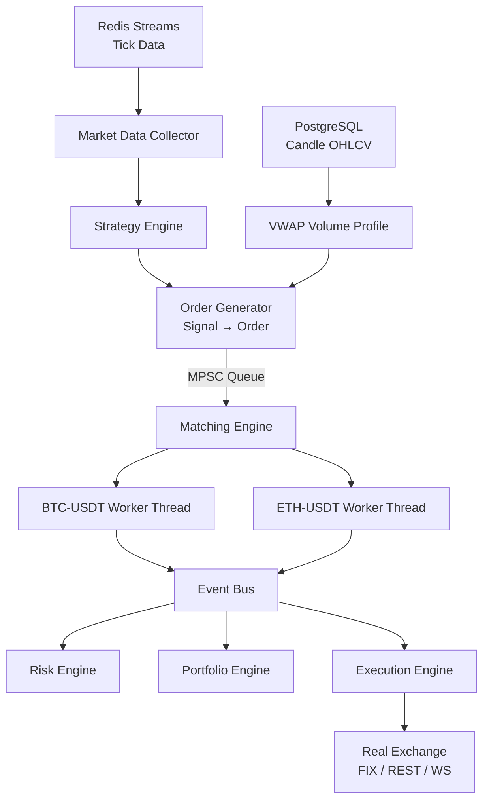

# C++ Order Book Engine — Architecture & Design Reference

## Overview

A **zero-allocation, lock-free, multi-symbol** matching engine written in modern C++20.  
Designed for sub-microsecond P99 matching latency on a single dedicated core per symbol.

---

## Core Design Principles

| Principle | Implementation |
|---|---|
| **No heap allocation on hot path** | `ObjectPool<Order, 1M>` pre-allocates all orders |
| **No mutex on hot path** | SPSC/MPSC lock-free queues for all cross-thread comms |
| **Cache-friendly structs** | [Order](file:///c:/Users/sharm/Documents/quant/order-book/src/core/order.hpp#10-62) is `alignas(64)` — fits 1-2 cache lines |
| **Per-symbol isolation** | One thread + one book per symbol — zero contention |
| **Price as integer** | `int64_t price = actual × 1,000,000` — no float rounding |
| **FIFO within price** | `std::list<Order*>` per [PriceLevelQueue](file:///c:/Users/sharm/Documents/quant/order-book/src/book/price_level.hpp#16-18) (price-time priority) |

---

## Data Flow



---

## Module Breakdown

### `src/core/`

| File | Purpose |
|---|---|
| `types.hpp` | Fundamental types: `Price`, `Quantity`, `OrderId`, all enums |
| `order.hpp` | `Order` (cache-aligned), `Trade`, `ExecutionReport`, `TopOfBook` |
| `lock_free_queue.hpp` | `SPSCQueue<T,N>` and `MPSCQueue<T,N>` — ring buffer, power-of-2 capacity |
| `object_pool.hpp` | `ObjectPool<T,N>` — atomic CAS free-list, avoids malloc |
| `event_bus.hpp` | Fan-out `EventBus` using per-subscriber SPSC queues |

### `src/book/`

| File | Purpose |
|---|---|
| `price_level.hpp` | Per-price FIFO queue of `Order*`. Iceberg replenishment. |
| `order_book.hpp` | Single-symbol book: `std::map<Price, PriceLevelQueue>` for bids/asks. Full matching logic, stop triggers, cancel, modify. |
| `slippage_estimator.hpp` | Walk-the-book simulation to estimate avg fill price and BPS slippage. |

### `src/engine/`

| File | Purpose |
|---|---|
| `matching_engine.hpp` | `MatchingEngine`: registers symbols, manages `SymbolWorker` threads, owns `ObjectPool` |
| `twap_vwap.hpp` | `TWAPExecutor` (equal time slices), `VWAPExecutor` (volume-weighted), `AlgoScheduler` |
| `smart_order_router.hpp` | `SmartOrderRouter`: ranks venues by slippage, greedily allocates quantity |
| `market_maker.hpp` | `MarketMaker`: two-sided post-only quotes, inventory skew, auto-refresh |

### `src/downstream/`

| File | Purpose |
|---|---|
| `risk_engine.hpp` | Pre-trade checks + position/notional/loss limits per client |
| `portfolio_engine.hpp` | Position tracking, average cost, realized/unrealized PnL, mark-to-market |
| `execution_engine.hpp` | Log/forward execution reports and trades to external exchange |

---

## Order Lifecycle

```
New Order Submitted
        │
        ▼
[Pre-Trade Risk Check] ──REJECT──► ExecutionReport(Rejected)
        │ PASS
        ▼
[ObjectPool.acquire()]   ← zero heap
        │
        ▼
[MPSC Queue → SymbolWorker]
        │
        ▼
[OrderBook.add_limit_order() / add_market_order()]
        │
      ┌─┴─────────────────────────────────┐
      │          Matching Loop             │
      │  Walk opposite side price levels   │
      │  Price-time FIFO fills              │
      │  Iceberg replenish on full fill    │
      └───────┬───────────────────────────┘
              │ Trades generated
              ▼
    [EventBus.publish(TradeEvent)]
    [EventBus.publish(ExecutionReport)]
    [EventBus.publish(TopOfBookEvent)]
              │
    ┌─────────┼──────────┐
    ▼         ▼          ▼
 RiskEng  Portfolio  ExecEng → Exchange
```

---

## Order Types

| Type | Behaviour |
|---|---|
| `Limit` | Rest at price; match if crossing |
| `Market` | Sweep book at any price (price set to MAX/MIN) |
| `StopLoss` | Sits in stop-map; triggers as market order when price drops below trigger |
| `TakeProfit` | Triggers as market order when price rises above trigger |
| `Iceberg` | `display_qty` visible; `ice_remaining` hidden reserve; replenished to BACK of queue |
| `TWAP` | Sliced into equal-time child market orders by `AlgoScheduler` |
| `VWAP` | Sliced by historical volume profile (candle data from PostgreSQL) |

---

## Special Order Flags

| Flag | Behaviour |
|---|---|
| `post_only` | Rejected if it would cross the spread (maker-only) |
| `hidden` | Quantity excluded from visible depth |
| `reduce_only` | Can only reduce existing position |
| `tif=IOC` | Cancel any unfilled remainder immediately |
| `tif=FOK` | Cancel entire order if not fully fillable immediately |

---

## Stop Order Trigger Logic

```
buy_stops_  → ordered by trigger price ascending
sell_stops_ → ordered by trigger price descending

After each trade (last_price updated):
  buy_stops_  : trigger all with trigger_price <= last_price  → convert to Market Buy
  sell_stops_ : trigger all with trigger_price >= last_price  → convert to Market Sell
```

---

## Market Data Analytics

| Metric | Formula |
|---|---|
| **Spread** | `best_ask - best_bid` |
| **Mid price** | `(best_bid + best_ask) / 2` |
| **Order Imbalance** | `(bid_qty5 - ask_qty5) / (bid_qty5 + ask_qty5)` ∈ [-1, +1] |
| **Liquidity Gap** | `spread > 10 × tick_size` |
| **Queue Position** | Estimated `ahead_qty` at time of insert (snapshot, not real-time) |

---

## Slippage Estimation

```
estimate(snapshot, side, order_qty, ref_price):
  Walk snapshot levels in order
  Accumulate fill_qty * fill_price
  avg_price = total_cost / total_filled
  slippage_cost = (avg_price - ref_price) * filled  [for buy]
  slippage_bps  = slippage_cost / (ref_price * filled) * 10000
```

---

## Smart Order Router

```
For each venue (symbol):
  1. Estimate slippage for full order_qty
  2. Sort venues by slippage_bps ascending
  3. Greedily allocate up to fillable_qty per venue
  4. Blend slippage weighted by notional
```

---

## Market Maker Logic

```
On mid_price update:
  1. Cancel existing bid/ask orders
  2. bid = mid - bid_offset - inventory_skew
     ask = mid + ask_offset - inventory_skew
  3. bid_qty = qty × (1.0 if short else 0.5)   [reduce overbought side]
     ask_qty = qty × (1.0 if long  else 0.5)
  4. Submit post_only bid and ask
  5. On fill: update net_position → adjust next refresh
```

---

## Integration Points

| External System | Direction | Protocol |
|---|---|---|
| Redis Streams (tick data) | → Strategy Engine | `hiredis` / XREAD |
| PostgreSQL (candles) | → VWAP volume profile | `libpq` / COPY |
| Real Exchange | Execution Engine → | FIX 4.4 / REST / WS |
| Feature Engine | ← TopOfBook events | Event Bus |
| Risk Engine | ← Trade events | Event Bus |

---

## Build

```bash
cmake -B build -DCMAKE_BUILD_TYPE=Release -DBUILD_TESTS=ON -DBUILD_BENCHMARKS=ON
cmake --build build -j$(nproc)
./build/src/order_book_engine          # demo
./build/tests/test_order_book          # unit tests
./build/benchmarks/bench_order_book    # performance benchmarks
```

> **Note**: The engine targets Linux/WSL2 with GCC 12+ or Clang 15+ for `__builtin_ia32_pause()` and hardware interference size. It compiles on Windows with MSVC in C++20 mode but busy-wait pause hints may be absent.
